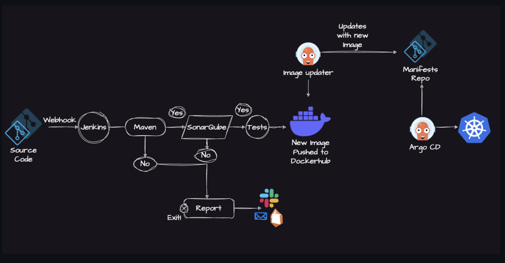

# jenkins-end-to-end-cicd-pipeline
Jenkins Pipeline for Java based application using Maven, SonarQube, Argo CD, Helm and Kubernetes
The CI/CD Pipeline architecture depicted in the diagram enables an end-to-end automated process for code integration, analysis, testing, containerization, and deployment to Kubernetes.

